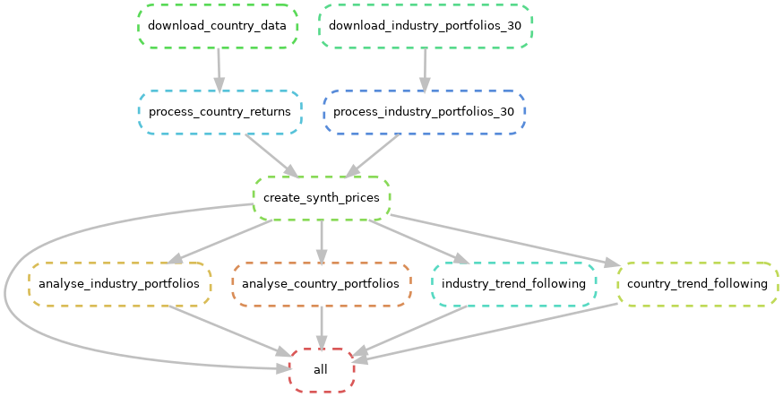

# Financial Market Returns

Empirical analysis of long-run financial market returns using data from
[Ken French's Data Library](https://mba.tuck.dartmouth.edu/pages/faculty/ken.french/data_library.html).
Results are published as a [MyST](https://mystmd.org/) Jupyter Book on GitHub Pages.

The project structure follows [cgroll/project-book-template](https://github.com/cgroll/project-book-template):
pipeline orchestration via [Snakemake](https://snakemake.readthedocs.io/),
dependency management via [uv](https://docs.astral.sh/uv/).

## Data sources

| Dataset | Source file | Frequency |
|---------|-------------|-----------|
| International country market returns | `F-F_International_Countries.zip` | Monthly |
| 30 Industry Portfolios | `30_Industry_Portfolios_daily_TXT.zip` | Daily |

Raw data is downloaded into `data/downloads/` (git-ignored) and processed
outputs are written to `data/processed/` (git-ignored). Both are fully
reproducible by running the pipeline.

## Quickstart

```bash
# 1. Install uv — https://docs.astral.sh/uv/
curl -LsSf https://astral.sh/uv/install.sh | sh

# 2. Install dependencies
uv sync

# 3. Run the full pipeline (downloads data if missing, skips up-to-date steps)
make run

# 4. Preview the book locally
make serve        # opens http://localhost:3000
```

## Pipeline overview



Regenerate after editing the Snakefile with `make dag` (requires `graphviz`).

## Pipeline commands

| Command | Effect |
|---------|--------|
| `make run` | Run all pipeline steps that are out of date |
| `make dry-run` | Preview what would run without executing |
| `make serve` | Build and serve the book locally at http://localhost:3000 |
| `make dag` | Regenerate `dag.png` from the current Snakefile |

Snakemake checks file timestamps automatically — re-run `make run` after
editing a pipeline script and only the affected steps will re-execute.

### Updating data

Downloaded data is tracked by the presence of the download directory.
To trigger a fresh download, delete the directory and re-run:

```bash
# Re-download international country data
rm -rf data/downloads/ken_french/international_countries
make run

# Re-download 30 industry portfolios
rm -rf data/downloads/ken_french/industry_portfolios_30
make run
```

To force-re-run a specific processing step without re-downloading:

```bash
uv run snakemake --cores 1 -R process_country_returns
uv run snakemake --cores 1 -R process_industry_portfolios_30
uv run snakemake --cores 1 -R create_synth_prices
uv run snakemake --cores 1 -R analyse_industry_portfolios
```

## Project layout

```
├── fmr/                     # Python package
│   ├── paths.py             # Centralized path configuration
│   ├── finance.py           # Financial computations (drawdowns, returns)
│   └── country_codes.py     # Ken French filename → ISO 3166-1 alpha-3 mapping
├── pipeline/                # Pipeline scripts
│   ├── 01_download_*.py     # Data acquisition
│   ├── 02_process_*.py      # Data cleaning and transformation
│   ├── 03_create_*.py       # Derived datasets
│   └── 04_analyse_*.py      # Analysis → executed notebooks
├── book/                    # MyST book source
│   ├── notebooks/           # Executed notebooks (Snakemake output, git-tracked)
│   ├── markdown/            # Static content
│   └── myst.yml             # TOC and site settings
├── data/                    # Git-ignored, reproduced by pipeline
│   ├── downloads/           # Raw downloaded data
│   └── processed/           # Cleaned and derived datasets
├── output/images/           # Figures (git-tracked for GitHub Pages)
├── Snakefile                # Pipeline DAG
└── contribution_conventions.md  # Conventions for contributors and AI agents
```

See [contribution_conventions.md](contribution_conventions.md) for full details
on adding pipeline stages, writing analysis scripts, and Snakemake conventions.

## Deployment

Every push to `main` builds and deploys the book to GitHub Pages automatically
(see `.github/workflows/`). Pull requests run only the build check.

To enable Pages on a new fork: **Settings → Pages → Source → GitHub Actions**.
